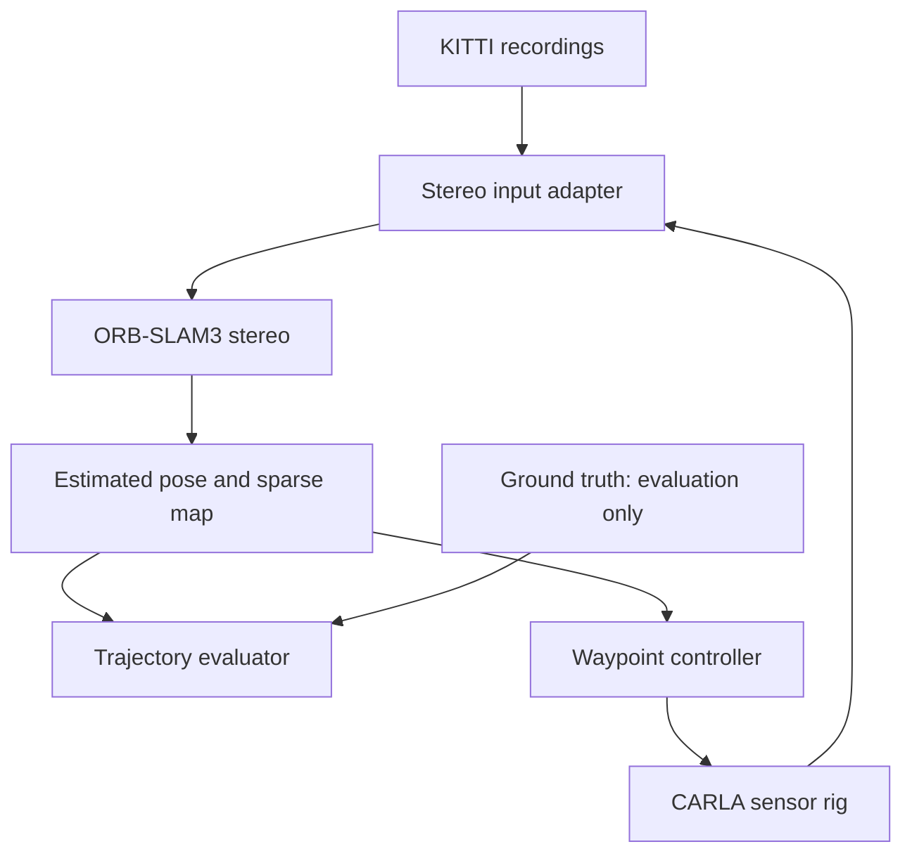

# Software-Only Evaluation of Visual SLAM for Autonomous Driving

**Course:** CMPE 249  
**Team member:** Shanthanu Gopikrishnan, Bhavdeep Randhawa
**Selected track:** Spatial Computing and Autonomous Systems  

## Abstract

This project evaluates an autonomous-driving localization pipeline using visual simultaneous localization and mapping (SLAM) Solution. ORB-SLAM3 will estimate vehicle motion from stereo images recorded in the KITTI dataset and generated in the CARLA simulator. Estimated trajectories will be compared with ground truth using trajectory error, tracking availability, and processing-rate metrics. If the localization pipeline is stable, its estimated pose will also be used by a basic waypoint-following controller in CARLA. The goal is to provide a reproducible evaluation of localization behavior, computational feasibility, and failure modes under simulated lighting, weather, motion, and traffic changes on a desktop equipped with an NVIDIA RTX 4070 SUPER.

## Problem Statement

Autonomous vehicles need a reliable estimate of their position when GPS is inaccurate, obstructed, or unavailable. Visual SLAM can estimate motion using cameras, but feature-based methods can lose tracking under low texture, rapid motion, difficult lighting, or dynamic traffic. This project asks:

> How accurately and reliably can ORB-SLAM3 localize a software-simulated vehicle and process real-world driving recordings, and is its pose estimate stable enough to support basic waypoint following in CARLA?

## Scope

### Core deliverables

- Run ORB-SLAM3 in stereo mode on selected KITTI odometry sequences.
- Create a synchronized stereo-camera vehicle configuration in CARLA.
- Feed CARLA stereo frames into ORB-SLAM3 without using simulator ground truth for localization.
- Compare estimated and ground-truth trajectories.
- Report Absolute Trajectory Error (ATE), Relative Pose Error (RPE), tracking availability, and processing rate.
- Evaluate baseline, low-light, rain, and dynamic-traffic scenarios.
- Attempt closed-loop waypoint following using the SLAM estimate.

### Future goals

- Add stereo-inertial processing.
- Accumulate LiDAR scans using ORB-SLAM3 pose estimates.
- Add a ROS2 interface.
- Compare ORB-SLAM3 with one recent learned odometry system.

Native LiDAR-camera fusion, dense neural reconstruction, multi-agent SLAM, Jetson deployment, and physical-vehicle testing are outside the semester scope.

## System Architecture



Ground truth is isolated from the localization and control path and is used only for evaluation.

## Inputs and Outputs

| Category | Contents |
|---|---|
| Inputs | Rectified left/right images, timestamps, camera calibration, and scenario metadata |
| Evaluation-only inputs | KITTI poses or CARLA ground-truth transforms |
| Primary outputs | Timestamped 6-DoF estimated trajectory and tracking state |
| Secondary outputs | ORB-SLAM3 sparse map, runtime logs, metric files, plots, and demo video |
| Control output | Steering, throttle, and braking commands from a basic waypoint controller |

## Success Criteria

The project uses tiered criteria so an integration issue in the controller does not invalidate the localization study.

### Minimum viable success

- Complete evaluation on at least three KITTI sequences and three CARLA scenarios.
- Track at least 90% of frames in the baseline CARLA scenario.
- Sustain at least 20 processed frames per second at the selected camera resolution.
- Produce repeatable ATE and RPE results from saved configurations and scripts.

### Target success

- Baseline translational ATE RMSE at or below 2% of route length after the declared trajectory alignment.
- At least 80% route completion in one CARLA waypoint route using only the SLAM pose for localization.
- Mean cross-track error below 1.5 m on that route.
- Quantified degradation across low-light, rain, and dynamic-traffic conditions.

These thresholds are project targets, not safety guarantees.

## Planned Technology

- Ubuntu 22.04
- ORB-SLAM3
- CARLA
- KITTI Odometry dataset
- C++, Python, OpenCV, Eigen, Pangolin, and evo
- NVIDIA RTX 4070 SUPER desktop GPU
- ROS2 and PCL only if core milestones are completed early

## Repository Structure

```text
.
|-- README.md
|-- docs/
|   |-- project_proposal.md
|   |-- literature_survey.md
|   `-- ai_novelty_feasibility_audit.md
|-- configs/       # planned camera and experiment configurations
|-- scripts/       # planned adapters, evaluation, and plotting scripts
|-- src/           # planned integration and controller code
`-- results/       # planned generated metrics and plots
```

## Evaluation Policy

- Ground truth will never be passed to ORB-SLAM3 or the waypoint controller.
- The same camera settings and evaluation code will be used across repeated runs.
- Failed runs and tracking losses will be reported rather than discarded.
- Hardware, resolution, simulator settings, and software versions will be recorded with results.
- Claims will be limited to dataset and simulation evidence.

## Baseline Resources

- [ORB-SLAM3](https://github.com/UZ-SLAMLab/ORB_SLAM3)
- [CARLA simulator](https://carla.org/)
- [KITTI Visual Odometry benchmark](https://www.cvlibs.net/datasets/kitti/eval_odometry.php)
- [evo trajectory evaluation tools](https://github.com/MichaelGrupp/evo)

